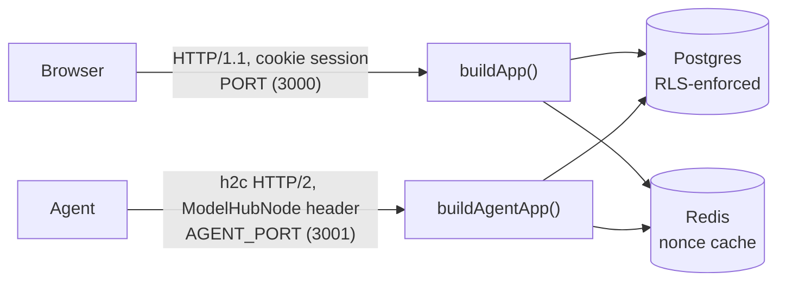
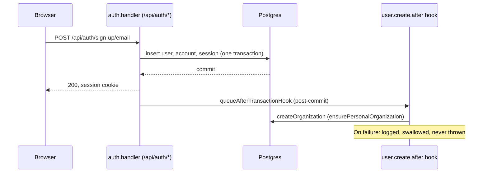
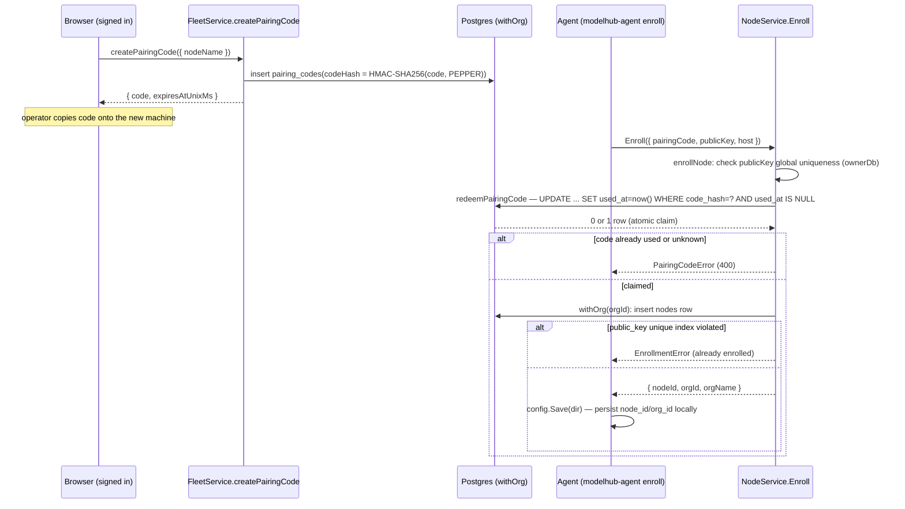
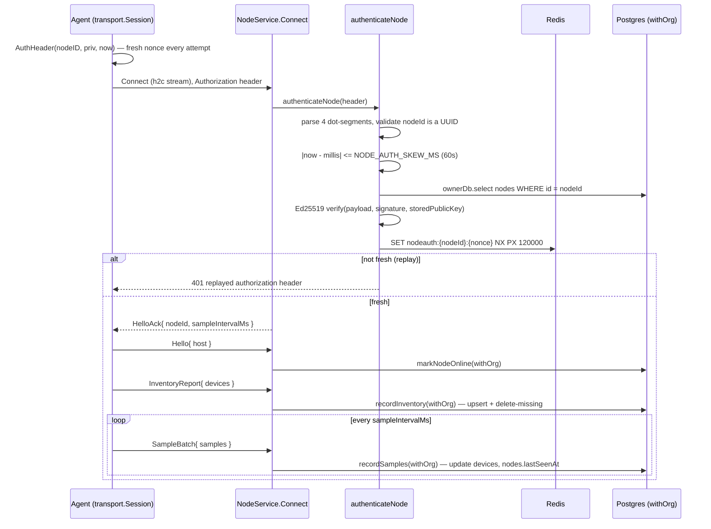
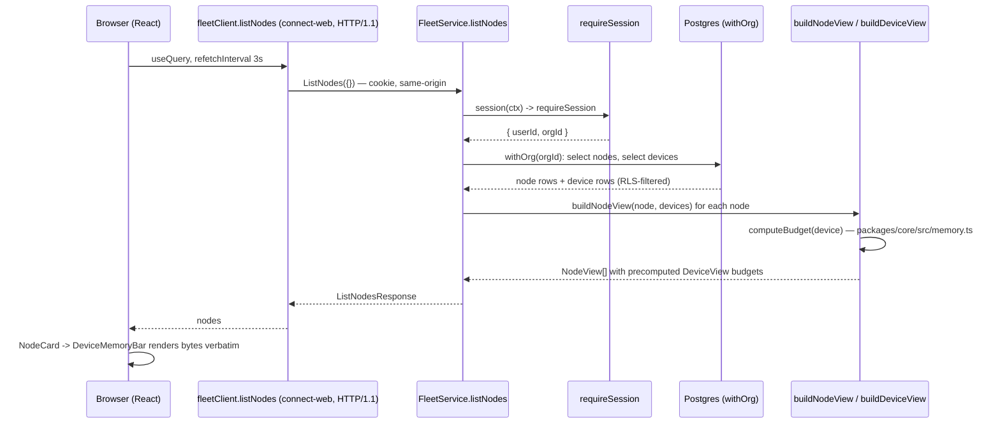

# Model Hub — Architecture (Slice 1)

Slice 1 delivers exactly one capability: install an agent on a machine you
own, have it join an organization, and watch its hardware — CPU, CUDA, or
Apple Metal devices, and how much memory on each is actually available for
work — show up in a web page. It does not run models, schedule anything, or
move any tensor. Every design choice below exists in service of that one
capability, done correctly: multi-tenant, cryptographically authenticated,
and honest about the arithmetic it reports.

This document describes *flow and responsibility* — what calls what, and
why the boundaries sit where they do. For type- and message-level structure,
see `docs/uml/`.

## 1. The shape of the system

Five deployables:

| Deployable | What it is | Where |
|---|---|---|
| Control plane | Fastify + ConnectRPC service, two listeners | `apps/control-plane` |
| Web app | React SPA (TanStack Router/Query) | `apps/web` |
| Agent | Go CLI + long-running service | `agent` |
| Postgres | Tenant data + Better Auth tables, RLS-enforced | `packages/db/migrations` |
| Redis | Nonce replay cache | `apps/control-plane/src/redis.ts` |

Two protocol paths connect them: the browser talks to the control plane over
plain HTTP/1.1 with a session cookie; the agent talks to the control plane
over ConnectRPC, which for its streaming method means HTTP/2.



### The two-listener split

The single most surprising fact in this codebase: the control plane is
**two separate Fastify instances**, started from `apps/control-plane/src/main.ts`:

```ts
const app = await buildApp();
await app.listen({ port: env.PORT, host: "0.0.0.0" });

const agentApp = await buildAgentApp();
await agentApp.listen({ port: env.AGENT_PORT, host: "0.0.0.0" });
```

`buildApp()` (`apps/control-plane/src/app.ts`) is a plain HTTP/1.1 server on
`PORT`. It hosts `/healthz`, Better Auth's `/api/auth/*`, `/api/me`, and
`FleetService` (the browser-facing Connect service). `buildAgentApp()`
(`apps/control-plane/src/agent-app.ts`) is constructed with `http2: true`
and hosts only `NodeService` (`Enroll` and the bidirectional `Connect`
stream), on `AGENT_PORT`.

The reason is real, not incidental, and the code says so directly:

> "NodeService.Connect is a true bidirectional stream, which needs HTTP/2
> framing. Browsers can't speak cleartext HTTP/2 (h2c) at all — they require
> TLS for HTTP/2 (ALPN negotiation) — so one HTTP/1.1, no-TLS port cannot
> also serve h2c."

Three constraints compound: Connect's bidi streaming requires HTTP/2 framing;
browsers refuse to negotiate HTTP/2 without TLS (no h2c in any browser); and
a single Fastify instance is either an HTTP/1.1 server or an HTTP/2 server,
not both at once. The Go agent, unlike a browser, is a controlled client
that *can* dial h2c directly (`agent/internal/transport/client.go` builds an
`http2.Transport` and, for `http://` URLs, overrides `DialTLSContext` to
open a plain TCP socket and send the HTTP/2 preface with no upgrade dance —
"prior knowledge" h2c). So the agent gets its own port that trades
browser-compatibility for a certificate-free dev setup. A production
deployment can collapse this back to one TLS-terminated port using
`allowHTTP1`, but that's explicitly future work — see §8.

`apps/web/src/components/AddNodeDialog.tsx` makes the split visible to
users too: the pairing instructions it prints tell the operator to point
the agent at `VITE_AGENT_URL` (default `http://localhost:3001`), not
`window.location.origin` — the browser's own origin is the wrong port for
an agent to dial.

## 2. The shared contract

`proto/modelhub/v1/*.proto` is the single source of truth for every message
that crosses a process boundary. `buf generate` (`proto/buf.gen.yaml`) emits
TypeScript into `packages/proto-ts/src/gen` and Go into `agent/gen`; both
are committed, so neither side needs buf installed to build.

Three files:

- **`common.proto`** — `HostInfo`, `DeviceKind` (`CPU`/`CUDA`/`METAL`),
  `MemoryPressure` (`NORMAL`/`WARN`/`CRITICAL`), `Device` (static facts,
  reported once per connection), `DeviceSample` (changing facts, reported on
  an interval).
- **`node.proto`** — `NodeService`: `Enroll` (unary, unauthenticated) and
  `Connect` (bidi stream, authenticated). The agent's outbound messages are
  wrapped in `AgentMessage{ oneof payload { Hello, InventoryReport,
  SampleBatch } }`; the server's replies in `ServerMessage{ oneof payload {
  HelloAck, AgentConfig } }`.
- **`fleet.proto`** — `FleetService`: `ListNodes`, `GetNode`,
  `CreatePairingCode`, browser-facing and session-scoped. `DeviceView`
  carries a comment worth quoting verbatim: *"A device with its budget
  already computed by the control plane. The browser never does memory
  arithmetic."*

Both stream directions use a `oneof` envelope rather than separate RPC
methods because `Connect` is one long-lived stream carrying heterogeneous
message types in sequence (a `Hello` once, an `InventoryReport` once, then
`SampleBatch` repeatedly) — a `oneof` lets Go and TypeScript each pattern-match
on `message.payload.case` (TS) or a type switch (Go) instead of needing N
separate streaming RPCs multiplexed by hand. `apps/control-plane/src/rpc/node-service.ts`
switches on `message.payload.case` (`"hello"`, `"inventory"`, `"samples"`);
`agent/internal/transport/session.go` constructs the mirror image with
`modelhub_v1.AgentMessage_Hello{...}`, `_Inventory{...}`, `_Samples{...}`.

## 3. The four end-to-end flows

### 3.1 Sign-up and organization creation

Every user must land in an organization, because every tenant row (`nodes`,
`devices`, `pairing_codes`) requires an `org_id`. Better Auth
(`apps/control-plane/src/auth/auth.ts`) is configured with the
`organization()` plugin and a `databaseHooks.user.create.after` hook that
calls `ensurePersonalOrganization(user)` — which itself just calls
`auth.api.createOrganization(...)`.



The critical detail is *when* the hook runs relative to the transaction: it
fires via `queueAfterTransactionHook`, i.e. **after** the sign-up
transaction that created the `user` row has already committed. The code
comment is explicit about the consequence:

> "With no `onAfterCommitHookError` configured, an exception here would
> propagate and fail the client's sign-up call even though the
> user/account/session rows are already durably in the database — stranding
> a real user with no organization and no way to retry sign-up (the email
> is taken)."

So the hook deliberately never throws; on failure it just logs. That leaves
a possible gap: a user who signed up successfully but has no organization.
`requireSession()` (`apps/control-plane/src/auth/session.ts`) closes it:

```ts
if (!orgId) {
  console.warn("[auth] session has no organization; creating one now (self-heal)", ...);
  try {
    const org = await ensurePersonalOrganization(session.user);
    orgId = org?.id ?? null;
  } catch (err) { ... orgId = null; }
}
if (!orgId) throw new HttpError(403, "no_organization", "user has no organization");
```

This self-heal runs on *every* authenticated request, at the exact point
the missing invariant would otherwise matter — a user with no org "can't do
anything anyway," so fixing it lazily on first use is strictly better than a
permanent, unrecoverable 403. Both paths share `ensurePersonalOrganization`
(same naming/slug scheme: `org-<12 hex chars>` slug,
`"<name-or-email>'s fleet"` display name) so an org created by the self-heal
looks identical to one created by the hook. `generateId({ model })` in the
same file forces organization ids to the shape `org_<32 hex>`, purely for
readability in logs/URLs.

### 3.2 Pairing and enrollment

Adding a machine is a two-actor handshake: a signed-in browser mints a
single-use code; an unauthenticated agent redeems it.



Pairing codes are eight characters from a 33-symbol alphabet (`ABCDEF...`
minus `I`, `O`, `0`, `1` — visually ambiguous on a screen someone is typing
from), formatted `XXXX-XXXX` (`apps/control-plane/src/domain/pairing.ts`,
`generateCode`). They are stored as an HMAC, not a plain hash:

> "Keyed with `PAIRING_CODE_PEPPER` (an application secret, never stored in
> the database) so that an attacker who obtains only
> `pairing_codes.code_hash`... cannot brute-force the ~40-bit codespace
> offline without also holding the pepper. A plain SHA-256 would not
> provide that."

Redemption is a single conditional `UPDATE ... WHERE used_at IS NULL
RETURNING *` — Postgres serializes concurrent updates to the same row, so
two agents racing the same code produce exactly one winner; the loser's
`UPDATE` affects zero rows and `redeemPairingCode` distinguishes "unknown
code" from "already used" by a follow-up `SELECT`. If the claimed code turns
out to be expired, it is released (`used_at` reset to `null`) so a retry
gets a stable "expired" message rather than "already used."

`enrollNode` (`apps/control-plane/src/domain/nodes.ts`) orders its checks
deliberately: the public-key uniqueness check runs **before**
`redeemPairingCode`. The comment explains why:

> "...a machine that is already enrolled should not burn a fresh, single-use
> code on an enrollment that was always going to fail — the common case
> here is a person re-running the agent's enroll command, not an attacker."

That check is advisory (it runs on `ownerDb` outside a lock, so a genuine
race is possible), which is why `nodes.public_key` also carries a real
unique index (`nodes_public_key_idx`, `packages/db/src/schema/fleet.ts`).
`isPublicKeyUniqueViolation` matches on both the `23505` SQLSTATE and the
specific constraint name, so this is a targeted backstop, not a catch-all
that could relabel an unrelated database fault as a client mistake.

Both `redeemPairingCode` and the pre-check run on `ownerDb`, not the RLS-scoped
`withOrg` connection — see §5 for why.

### 3.3 Authentication and the heartbeat stream

Once enrolled, the agent's every future connection presents a signed header
instead of a session cookie. The header format and the exact bytes signed
are defined identically on both sides.

**Go** (`agent/internal/transport/auth.go`, `AuthHeader`):

```go
payload := fmt.Sprintf("%s.%d.%s", nodeID, now.UnixMilli(), nonce)
signature := base64.RawURLEncoding.EncodeToString(ed25519.Sign(priv, []byte(payload)))
return "ModelHubNode " + payload + "." + signature
```

**TypeScript** (`apps/control-plane/src/rpc/node-auth.ts`, `authenticateNode`):

```ts
const parts = headerValue.slice(PREFIX.length).split(".");
const [nodeId, millis, nonce, signature] = parts;
...
ok = verify(null, Buffer.from(`${nodeId}.${millis}.${nonce}`), keyObject,
            Buffer.from(signature, "base64url"));
```

The cross-language contract is explicit in both files' comments: Go builds
the header's first three dot-joined segments and the signed payload **from
the same string literal**, and the server verifies against **the raw,
untouched segments it received off the wire** — not a re-serialization of
parsed fields. If either side reformatted a field (e.g. re-encoding the
millis as a different width) before verifying, a byte-identical signature
would fail. The header is `ModelHubNode <nodeId>.<unixMillis>.<nonce>.<signature>`,
base64url throughout (Go emits unpadded `RawURLEncoding`; Node's decoder
accepts both padded and unpadded).



Skew and replay work together: `NODE_AUTH_SKEW_MS` defaults to 60,000
(`apps/control-plane/src/env.ts`), so a header is accepted only within ±60s
of server time. The Redis nonce key TTL is *twice* the skew window —
`env.NODE_AUTH_SKEW_MS * 2` — because "that is exactly how long a nonce
presented right at the edge of the window could still fall inside it on
retry" (comment in `node-auth.ts`). The replay check lives in Redis, not an
in-process `Map`, "because the control plane is stateless across replicas
by design." A fresh header (fresh nonce, current timestamp) is generated on
**every** reconnect attempt in `Session.connectOnce`, never cached — a
reused header would eventually fall outside the skew window or collide with
its own nonce.

`authenticateNode` runs the node lookup on `ownerDb`, not through
`withOrg`, and the reason recurs throughout this codebase: the caller has
no session and no org context yet; *which* org it belongs to is this
function's **output**, not an input, so there is no `orgId` available to
scope the query. The Ed25519 key is stored as a raw 32-byte public key
(`bytea`) and wrapped in a fixed SPKI DER prefix at verification time
(`SPKI_ED25519_PREFIX`, confirmed byte-for-byte against a real
`generateKeyPairSync("ed25519")` export) rather than pulling in a dependency
just to parse it.

Once authenticated, `NodeService.connect` in
`apps/control-plane/src/rpc/node-service.ts` yields `HelloAck` **before**
reading anything from the agent's stream — authentication is the very first
thing that happens, so an unauthenticated caller "can never cause a write."
`recordInventory` treats an empty device list as a real claim ("this node
has none right now"), deleting every device row for the node rather than
treating an empty report as a no-op; `recordSamples` treats an empty sample
batch as a no-op on devices but still updates `nodes.lastSeenAt` — the node
is alive even if it happened to have nothing to sample that tick.

### 3.4 Reading the fleet



`FleetService.listNodes` (`apps/control-plane/src/rpc/fleet-service.ts`)
wraps every call in `session(ctx)`, which adapts Connect's `HandlerContext`
into the `{ headers }` shape `requireSession` expects and collapses both of
`requireSession`'s failure modes (401 no-session, 403 no-org) into a single
`Code.Unauthenticated` — any other thrown error (a genuine DB fault) is
deliberately left uncaught, falling through to Connect's default
`Code.Internal` mapping. Inside `withOrg(orgId, ...)`, plain `select`
queries against `nodes` and `devices` run — RLS does the filtering; there
is no explicit `WHERE org_id = ...` in the application code for these reads.

`buildNodeView`/`buildDeviceView` (`apps/control-plane/src/domain/views.ts`)
are where raw device rows become `DeviceView`s: every budget field
(`managedBytes`, `foreignBytes`, `headroomBytes`, `availableBytes`,
`schedulable`) comes from a single call to `computeBudget` in
`packages/core/src/memory.ts` — see §4. The browser never sees raw
`usedBytes`; it only ever sees the already-computed budget.
`DeviceMemoryBar.tsx` documents this boundary in its own comment: *"Every
byte figure rendered by this component... comes straight from computeBudget
on the server — this file never adds, subtracts, or clamps any of them."*
It does derive one purely presentational value, a bar-segment width
percentage, but that's layout math on numbers already computed, not budget
math. The fleet page polls every 3 seconds (`apps/web/src/routes/fleet.tsx`)
rather than streaming — noted in-code as *"Replaced by a stream in slice
8."*

## 4. The memory model

`packages/core/src/memory.ts`'s `computeBudget` is the single source of
truth for "how much of this device can we actually schedule onto." It runs
**once**, on the control plane, inside `buildDeviceView` — never in the
browser, never in the agent. Two structural reasons drive that placement:
first, the browser is explicitly forbidden from doing this arithmetic (see
§3.4) so that every viewer of the fleet page sees numbers computed by the
same code, not by whatever's cached in a stale tab; second, memory pressure
is folded directly into `schedulable`, not reported as a separate signal —
the function's own comment states it plainly:

> "Memory pressure is a scheduling signal, not just telemetry: at warn we
> stop placing here, and at critical the agent is already evicting."

That is: `pressure !== "normal"` forces `availableBytes` to `0` and
`schedulable` to `false`, unconditionally, regardless of how much raw
headroom the arithmetic below would otherwise compute.

Every device kind reduces to the same skeleton — `ceiling - foreignBytes -
managedBytes - headroomBytes`, clamped to `[0, totalBytes]` — but the three
kinds fill in `ceiling` and `headroomBytes` with genuinely different
formulas, because the three kinds of memory behave differently:

**CUDA** — dedicated VRAM, so the ceiling is simply `totalBytes`, and the
term that matters is `foreignBytes`: whatever another process (or the driver
itself) is holding.

```ts
case "cuda": {
  headroomBytes = Math.max(HEADROOM_MIN_BYTES, Math.floor(totalBytes * HEADROOM_FRAC));
  ceiling = totalBytes;
  break;
}
```

`HEADROOM_FRAC` is 8%, floored at `HEADROOM_MIN_BYTES` (512 MiB) so a small
GPU doesn't get an unrealistically thin headroom — this covers
"fragmentation and driver context overhead," per the constant's own comment.

**Apple unified memory (Metal)** — GPU and CPU share physical RAM, so there
is no separate VRAM ceiling; instead the ceiling is whichever of two limits
binds first:

```ts
case "metal": {
  const reserveFrac = input.interactive ? INTERACTIVE_RESERVE_FRAC : OS_RESERVE_FRAC;
  const osReserve = Math.max(OS_RESERVE_MIN_BYTES, Math.floor(totalBytes * reserveFrac));
  const wiredLimit = input.wiredLimitBytes && input.wiredLimitBytes > 0
    ? input.wiredLimitBytes
    : Math.floor(totalBytes * METAL_DEFAULT_CEILING_FRAC);
  headroomBytes = 0; // The OS reserve already plays this role here.
  ceiling = Math.min(wiredLimit, totalBytes - osReserve);
  break;
}
```

`ceiling = min(wiredLimitBytes, totalBytes - osReserve)`. `wiredLimitBytes`
comes from `iogpu.wired_limit_mb` on the machine (an administrator-set
sysctl; `agent/internal/inventory/probe_darwin.go` reads it and reports 0 if
unset). When unset, the ceiling falls back to 75% of physical memory
(`METAL_DEFAULT_CEILING_FRAC`) — "Apple's practical ceiling when the system
reports no explicit wired limit." `headroomBytes` is deliberately zero here:
the OS reserve subtraction already plays that role, so adding a second,
separate headroom term would double-count.

**CPU** — system RAM, ceiling is `totalBytes`, and the reserved fraction
plays the role `headroomBytes` does elsewhere:

```ts
case "cpu": {
  const reserveFrac = input.interactive ? INTERACTIVE_RESERVE_FRAC : OS_RESERVE_FRAC;
  headroomBytes = Math.max(OS_RESERVE_MIN_BYTES, Math.floor(totalBytes * reserveFrac));
  ceiling = totalBytes;
  break;
}
```

Metal and CPU share one more knob: `interactive` bumps the reserved
fraction from 15% (`OS_RESERVE_FRAC`) to 30% (`INTERACTIVE_RESERVE_FRAC`) —
"someone's daily-driver machine: reserve much more for them." The `devices`
table carries an `interactive` column (`packages/db/src/schema/fleet.ts`,
default `false`) that `buildDeviceView` reads, but no RPC or UI path in
this slice ever sets it to `true` — see §8.

### Worked example, agent to pixel

Take the CUDA case exactly as asserted in
`packages/core/src/memory.test.ts`: a 24 GiB GPU where the agent's NVML
probe (`agent/internal/inventory/probe_nvml.go`, `Sample`) reports
`UsedBytes = 10 GiB` (everything the driver sees in use, ours and everyone
else's) and the control plane's own bookkeeping — still 0 in slice 1, since
nothing loads models yet, but the arithmetic is written generally — has
`managedBytes = 6 GiB`:

1. Agent → control plane, in `DeviceSample`: `usedBytes = 10 GiB`.
   Control plane already has `managedBytes = 6 GiB` from its own state.
2. `computeBudget({ kind: "cuda", totalBytes: 24 GiB, usedBytes: 10 GiB, managedBytes: 6 GiB })`:
   - `foreignBytes = clamp(10 GiB − 6 GiB, 0, 24 GiB) = 4 GiB`
   - `headroomBytes = max(512 MiB, floor(24 GiB × 0.08)) ≈ 1.92 GiB`
   - `ceiling = 24 GiB`
   - `availableBytes = clamp(24 − 4 − 6 − 1.92, 0, 24) GiB ≈ 12.08 GiB`
   - `schedulable = true` (pressure is `normal`)
3. `buildDeviceView` packs these straight into `DeviceView`:
   `totalBytes=24Gi, managedBytes=6Gi, foreignBytes=4Gi, headroomBytes≈1.92Gi,
   availableBytes≈12.08Gi, schedulable=true`.
4. `DeviceMemoryBar.tsx` receives that struct unchanged. It computes one
   presentational number per segment — `percent(managedBytes, totalBytes) =
   25%`, `percent(foreignBytes, totalBytes) ≈ 16.67%`, etc. — purely to size
   four `<div>` widths in a stacked bar, and prints each byte count through
   `formatBytes` for the caption underneath. No arithmetic on the budget
   numbers themselves happens here.

The Metal case in the same test file shows the "whichever binds first"
ceiling concretely: 128 GiB total, 96 GiB wired limit, 15% OS reserve floor
of 8 GiB → `osReserve = max(8, 128×0.15) = 19.2 GiB` → `ceiling = min(96,
128 − 19.2) = 96 GiB` (the wired limit binds, not the OS reserve) — with
`usedBytes=20 GiB, managedBytes=16 GiB` giving `foreignBytes=4 GiB` and
`availableBytes = 96 − 16 − 4 = 76 GiB`.

## 5. Tenant isolation

Isolation is enforced by Postgres row-level security, not by application
code remembering to filter. Migration `packages/db/migrations/0001_roles_and_rls.sql`:

```sql
CREATE ROLE modelhub_app LOGIN PASSWORD 'devpassword';
-- deliberately NOT the table owner: an owner would bypass RLS silently

ALTER TABLE nodes         ENABLE ROW LEVEL SECURITY;
ALTER TABLE devices       ENABLE ROW LEVEL SECURITY;
ALTER TABLE pairing_codes ENABLE ROW LEVEL SECURITY;

CREATE POLICY nodes_org_isolation ON nodes
  USING (org_id = current_setting('app.current_org_id', true))
  WITH CHECK (org_id = current_setting('app.current_org_id', true));
-- identical policy shape on devices and pairing_codes
```

`packages/db/src/client.ts` defines two connections against two Postgres
roles:

- `db` (exported as `appSql`/`db`), connected as `modelhub_app` — the
  restricted role. It cannot bypass RLS: "a query that forgets `withOrg()`
  returns nothing rather than everything."
- `ownerDb`, connected as the table owner — reserved for "migrations and
  tests only — never request handling," per its own comment (a promise the
  request-handling code otherwise breaks in exactly the two places
  described below).

`withOrg(orgId, fn)` is how every ordinary tenant query is scoped:

```ts
export async function withOrg<T>(orgId: string, fn: (tx: Tx) => Promise<T>): Promise<T> {
  return db.transaction(async (tx) => {
    await tx.execute(sql`select set_config('app.current_org_id', ${orgId}, true)`);
    return fn(tx);
  });
}
```

`set_config(..., true)` scopes the setting to the transaction, so there is
no risk of one request's org id leaking into a pooled connection reused by
another request. `packages/db/src/rls.test.ts` proves the policy end to
end: a query under `withOrg(orgA, ...)` sees only `orgA`'s nodes even when
it explicitly filters `WHERE org_id = orgA` from inside org B's context
(RLS still hides the row); an insert of a row with a foreign `org_id`
throws a "row-level security" error; and a query against the bare `db`
connection with no org set returns nothing at all.

`organization`, `user`, `session`, `account`, `member`, and `invitation`
(`packages/db/src/schema/auth.ts`) are Better Auth's own tables and
deliberately carry **no** RLS — "Better Auth needs unrestricted access to
its own tables."

Two request paths bypass `withOrg` and go straight to `ownerDb`, and both
are principled, not accidental:

- **Node authentication** (`node-auth.ts`, `authenticateNode`) looks up a
  node by id on `ownerDb`.
- **Pairing-code redemption and the enrollment uniqueness check**
  (`pairing.ts`'s `redeemPairingCode`, `nodes.ts`'s pre-check in
  `enrollNode`) run on `ownerDb`.

Both share the same structural reason: `withOrg` requires an `orgId` to set
as the session variable, and in both flows the caller **has no organization
context yet** — establishing one is the very output of the call, not an
input to it. An agent presenting a node-auth header hasn't proven which org
it's in until the signature check and node lookup succeed; a pairing code
being redeemed *is* the thing that reveals which org the new node belongs
to. Everything downstream of that point — `markNodeOnline`,
`recordInventory`, `recordSamples`, the `insert` into `nodes` after
`redeemPairingCode` returns an `orgId` — immediately switches to `withOrg`.
The offline sweeper (`jobs/offline-sweeper.ts`) is the third `ownerDb` user,
for an unrelated reason: it's a fleet-wide background job with no single
org context, and it only ever flips a `status` column — "there is no
tenant data to leak through it."

## 6. The agent's internals

The agent (`agent/`) is a single Go binary, built around four internal
packages plus a Cobra CLI in `cmd/agent/main.go`.

```mermaid
graph TD
    CLI["cmd/agent (cobra: status/enroll/run/install/uninstall)"]
    Config["internal/config\nidentity (keychain/file), config.json, paths"]
    Inventory["internal/inventory\nProbe interface + cpu/darwin/nvml probes"]
    Transport["internal/transport\nclient, enroll, auth, Session"]
    Service["internal/service\nOS service wrapper (launchd/systemd/Windows)"]

    CLI --> Config
    CLI --> Inventory
    CLI --> Transport
    CLI --> Service
    Service -->|execs "modelhub-agent run"| CLI
    Transport --> Inventory
```

**`config`** owns identity and on-disk state. `paths.go`'s `Dir()` resolves
to `/etc/modelhub` (root) or the user's config dir (non-root), overridable
via `MODELHUB_CONFIG_DIR` — the override exists specifically so two agent
instances on one dev machine don't collide. `identity.go` prefers the OS
keychain (`keyringIdentity`, scoped by a SHA-256 hash of the resolved config
dir so two config dirs never share one keychain entry) and falls back to a
0600 file (`fileIdentity`) when no keychain is available — headless Linux,
a locked login keyring. Both `Save` (config) and the file fallback (`identity`)
write via a temp-file-then-rename pattern (`writeFile` in `paths.go`) so a
crash mid-write never leaves a truncated config or a half-written private
key.

**`inventory`** defines the `Probe` interface —
`Name() / Discover(ctx) / Sample(ctx, Device)` — and its own comment states
the design intent: "Implementations know nothing about the network; that
separation is what makes the whole connect loop testable without hardware."
`probe_cpu.go` is unconditionally included (a node with no accelerator is
still a node). `probe_darwin.go` (`//go:build darwin`) reports Metal unified
memory via `sysctl` reads only — no cgo shim yet, deferred to slice 2 per
its own comment. `probe_nvml.go` (`//go:build nvml`) and `probe_nvml_stub.go`
(`//go:build !nvml`) split CUDA support behind a build tag, since NVML
requires the NVIDIA driver to be present at link time; `probe_other.go`
(`//go:build !darwin`) stubs out the platform probe on non-macOS. NVML's
`DeviceGetUUID` is preferred over the enumeration index for a device's
`LocalID` specifically because the control plane's `recordInventory`
deletes any device not reported on the current pass — an index-based id
would churn every row if the BIOS ever reassigns PCIe enumeration order.
`Inventory.SampleAll` tolerates one probe failing (logs and drops that
device) so "one GPU that has fallen off the bus must not stop the node
reporting the others" — but `inventory.Collect` (discovery) is all-or-nothing,
so a discovery failure is treated as connection-level and retried by the
backoff loop rather than silently reporting an empty device list.

**`transport`** is `client.go` (the shared `http.Client`, h2c-forcing —
see §1), `enroll.go` (the one-shot `Enroll` RPC), `auth.go`
(`AuthHeader` — see §3.3), and `session.go` (`Session`, the long-lived
reconnect loop).

`Session.Run` is the outer loop: it calls `connectOnce`, and on any
return — error or clean server-initiated close — waits, then retries, with
**full-jitter exponential backoff**:

```go
wait := time.Duration(rand.Int63n(int64(backoff) + 1))
...
backoff *= 2
if backoff > maxBackoff { backoff = maxBackoff }
```

The comment states the reason directly: "without it, a fleet that loses the
control plane all reconnects in lockstep the moment it returns." Backoff
starts at 1s (`MinBackoff` default) and caps at 30s (`MaxBackoff` default).

`connectOnce` does, in order: authenticate (fresh header every attempt —
never reused across reconnects, since skew and nonce-replay would reject a
stale one), send `Hello`, block on the first `Receive()` for `HelloAck`
(which carries the sample interval), `inventory.Collect` (discovery),
send `InventoryReport`, then loop on a ticker at the server-given interval,
calling `SampleAll` and sending `SampleBatch` each tick. A second goroutine
drains `stream.Receive()` continuously — both so a mid-stream `AgentConfig`
update is observed, and so a server hang-up is noticed immediately rather
than only at the next sample tick; that goroutine calls the parent
`cancel()` on any receive error, which is how a server-side close reaches
the sampling loop's `select` promptly.

Cancellation is deliberately plumbed to reach every blocking point:
`connectOnce` derives `streamCtx` from the caller's `ctx` via
`context.WithCancel`; `stream.Send`/`Receive`, `inventory.Host(streamCtx)`,
`inventory.Collect(streamCtx, ...)`, `inv.SampleAll(streamCtx)`, and the
ticker's `select` all observe either `streamCtx` directly or the same
`cancel()` call from the receive goroutine. `Run`'s doc comment promises the
resulting contract precisely: *"a cancelled ctx always yields a nil return,
from whichever state Run was in — waiting on backoff, blocked on the
stream, or mid-sample."* On a clean `streamCtx.Done()`, `connectOnce`
calls `stream.CloseRequest()` to close the send side gracefully rather than
just dropping the connection.

**`service`** wraps `kardianos/service` for launchd/systemd/Windows. It's a
thin adapter: `Install()` registers a service whose `Arguments` are
`["run"]`, so the OS service manager execs `modelhub-agent run` — the exact
same code path `cmd/agent`'s `newRunCmd` already runs interactively, with
the exact same signal-driven shutdown (`signal.NotifyContext` in `main.go`
plus `Session.Run`'s context-cancellation return). The `runner` type exists
only to satisfy the `service.Interface` contract; its own `Start`/`Stop`
are not exercised by the installed service (which execs a fresh process)
but are kept correct in case anything calls `Service.Run()` directly.

## 7. Failure behavior

**A node goes silent.** `apps/control-plane/src/jobs/offline-sweeper.ts`
runs `sweepOfflineNodes` on a 5-second timer (`startOfflineSweeper`,
started only by `main.ts` — tests drive `sweepOfflineNodes` manually, on
their own clock, so they don't race a real timer). It marks a node
`degraded` after `DEGRADED_AFTER_MS` and `offline` after
`OFFLINE_AFTER_MS`, which are three and six times `SAMPLE_INTERVAL_MS`
(15s and 30s at its 5s default) — three and six missed heartbeats, derived
rather than hardcoded so the thresholds stay correct when the interval the
server hands the agent is configured to something else. The two
passes run in a specific order — offline first, then degraded — so that a
node silent for 40 seconds lands on `offline` directly, rather than the
degraded pass (which only touches nodes still `online`) catching it first
and stranding it at `degraded`.

**A probe fails mid-sample.** `Inventory.SampleAll` logs and drops that one
device's sample (`inventory.go`) rather than failing the batch or crashing
the agent; the next tick tries again. A probe failing during *discovery*
(`Collect`) is treated more severely — the whole connection attempt fails
and `Session.Run`'s backoff retries it, since a `nil` inventory can't be
sampled from at all.

**The stream drops.** Either side closing the H2 stream — server restart,
network blip, `ctx` cancellation — surfaces as an error (or a clean EOF) out
of `stream.Send`/`Receive` inside `connectOnce`, which returns it up to
`Run`, which logs, waits out the jittered backoff, and reconnects with a
brand-new authenticated header. On the server side, nothing needs cleaning
up explicitly: the node simply stops sending `SampleBatch`es, `lastSeenAt`
stops advancing, and the offline sweeper (above) eventually reflects that
in `status`.

**A pairing code is reused.** The second redemption attempt's conditional
`UPDATE ... WHERE used_at IS NULL` affects zero rows;
`redeemPairingCode`'s follow-up `SELECT` finds the row anyway and throws
`PairingCodeError("pairing code already used")`, mapped to
`Code.InvalidArgument` (`node-service.ts`'s `enroll` handler) — the agent
operator sees a specific, actionable message rather than a generic failure.
An expired code is released back to `used_at = null` on the failing attempt
specifically so that a *retried* redemption of the same expired code gets
the same "expired" message every time, rather than flipping to "already
used" because the failed attempt itself claimed it.

## 8. Deliberate boundaries

What this slice explicitly does not do, per the code's own comments and
what's simply absent:

- **No model execution or scheduling.** `managedBytes` is always `0`
  (`DeviceSample` proto comment: *"always 0 in slice 1"*) — nothing is ever
  loaded onto a device. The whole memory-budget machinery exists so slice 2+
  has correct numbers to schedule against, not because anything schedules
  yet.
- **No `interactive` device flag path.** `devices.interactive` exists in
  the schema and `computeBudget` honors it, but no RPC or UI in this slice
  ever sets it away from its `false` default.
- **No Metal cgo shim.** `probe_darwin.go` reads unified-memory totals via
  `sysctl` only; distinguishing Model Hub's own allocations
  (`recommendedMaxWorkingSetSize`) from everyone else's arrives in slice 2.
- **No live push to the browser.** The fleet page polls every 3 seconds
  (`fleet.tsx`); a real stream is slice 8's work per its own comment.
- **No production TLS topology for the agent port.** `buildAgentApp()`
  serves h2c with no TLS in dev; collapsing back to one TLS-terminated port
  via `allowHTTP1` is called out as "for a later slice" in its own comment.
- **No cross-org RBAC.** Any member of an organization can mint pairing
  codes and view the fleet — there's no owner/member distinction enforced
  in `FleetService`, even though Better Auth's `organization` plugin tracks
  a `member.role` column.
- **No audit trail or rate limiting** on pairing-code minting or node
  enrollment attempts.
- **No historical metrics.** `devices.lastUsedBytes` and friends are
  overwritten on every sample; there is no time series, only "most recent."
- **No Windows or non-NVIDIA GPU probes**, and CUDA support requires an
  explicit `nvml` build tag — the default agent binary reports CPU (and
  Metal, on macOS) only.
