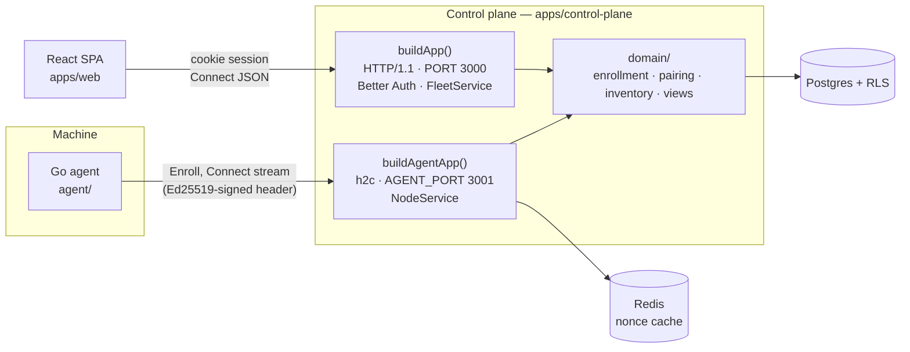
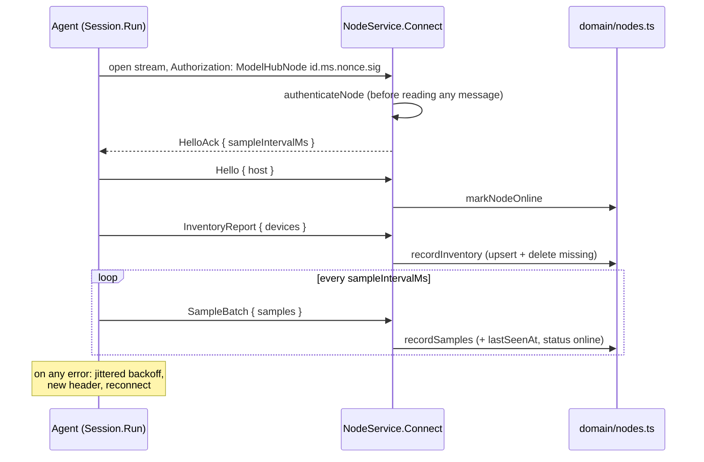

# Codebase guide

How Model Hub is put together, where each piece lives, and the rules that
keep it that way. Read this before changing code; read the code for the
details. `docs/install.md` covers running the agent on real hardware and
`docs/deployment.md` covers production.

## 1. The system in one picture

Model Hub is slice 1 of a local-AI cluster manager: an agent on each machine
enrolls into an organization, streams its hardware inventory, and a web app
shows the fleet live with the memory that is actually schedulable on each
device. Nothing runs models yet.



**Why two listeners.** `NodeService.Connect` is a bidirectional stream and
needs HTTP/2. Browsers cannot speak cleartext HTTP/2, so in development the
browser gets HTTP/1.1 on `PORT` and agents get h2c on `AGENT_PORT`. Both are
built in `apps/control-plane/src/server.ts`, which gives them the same Connect
mounting, JSON 404, and error handler. Production collapses them behind one
TLS port (`docs/deployment.md` §4.1).

## 2. Where things live

```
proto/modelhub/v1/        The wire contract. common.proto (HostInfo, Device, DeviceSample, enums),
                          node.proto (NodeService: agents), fleet.proto (FleetService: browsers).
packages/proto-ts/        Generated TypeScript for the contract (committed; `pnpm --filter @modelhub/proto generate`).
agent/gen/                Generated Go for the contract (committed; same buf.gen.yaml).
packages/core/            computeBudget(): the memory model. Pure, no I/O, the only place it lives.
packages/db/              Drizzle schema + migrations, the two connection pools, withOrg(), isUuid().
apps/control-plane/src/
  server.ts               buildApp() and buildAgentApp(): the two listeners, /healthz, /api/auth/*, /api/me.
  main.ts                 Starts both listeners and the offline sweeper. Nothing else starts the sweeper.
  env.ts                  Every environment variable, validated with zod at import time.
  auth/auth.ts            The Better Auth instance and the personal-organization hook.
  auth/session.ts         requireSession(headers): session → { userId, orgId, user }, with org self-heal.
  rpc/fleet-service.ts    FleetService (browser): ListNodes, GetNode, CreatePairingCode.
  rpc/node-service.ts     NodeService (agent): Enroll, Connect.
  rpc/node-auth.ts        authenticateNode(): verifies the agent's signed header.
  domain/nodes.ts         enrollNode, markNodeOnline, recordInventory, recordSamples.
  domain/pairing.ts       mintPairingCode, redeemPairingCode.
  domain/wire.ts          All proto ↔ database translation: enum names, host columns, NodeView/DeviceView.
  jobs/offline-sweeper.ts sweepOfflineNodes(now): online → degraded → offline.
  test-helpers.ts         Fixtures for integration tests and e2e (orgs, nodes, keys, signed headers, sign-up).
apps/web/src/
  api.ts, auth.ts         The FleetService client and the Better Auth client. Both same-origin.
  router.tsx              /sign-in, /sign-up, and the authenticated layout with / (fleet).
  routes/auth.tsx         AuthForm (shared, presentational) + SignInRoute / SignUpRoute.
  routes/fleet.tsx        Polls ListNodes every 3 s.
  components/             NodeCard, DeviceMemoryBar (typed by the generated NodeView/DeviceView), AddNodeDialog.
  format.ts               formatBytes, formatRelativeTime. Formatting only, never budget arithmetic.
agent/
  cmd/agent/main.go       The CLI: status, enroll, run [--fake-probe], install, uninstall.
  internal/config/        config.json (Config, Dir, Load/Save/ClearEnrollment) and identity.go (the Ed25519 key).
  internal/inventory/     Probe interface, Collect/SampleAll, Host(); probes for cpu, metal (darwin), cuda (nvml tag), fake.
  internal/transport/     client.go (HTTP/2 client, AuthHeader), enroll.go, session.go (the connect loop), proto.go.
  internal/service/       Registers `modelhub-agent run` with launchd/systemd/Windows.
e2e/smoke.test.ts         Builds the real agent binary and runs it against the real control plane.
vitest.env.ts             Shared test setup: loads the repo-root .env if present.
```

## 3. The four flows

### 3.1 Sign-up

1. The browser posts to `/api/auth/sign-up/email`; `server.ts` forwards every
   `/api/auth/*` request to Better Auth.
2. Better Auth commits the user, then runs the `user.create.after` hook in
   `auth/auth.ts`, which creates a personal organization (`org_<hex>` id).
3. That hook runs *after* commit, so it must not throw: a failure would fail
   a sign-up whose email is already taken. It logs instead, and
   `requireSession()` creates the organization on the user's next request
   ("self-heal"). A user is therefore never permanently org-less.

### 3.2 Pairing and enrollment

1. **Mint** (browser → `FleetService.CreatePairingCode`): `mintPairingCode`
   generates `XXXX-XXXX` from an alphabet without `I O 0 1`, and stores only
   `HMAC-SHA256(PAIRING_CODE_PEPPER, normalized code)` with a 15-minute expiry.
2. **Enroll** (`modelhub-agent enroll --code … --server …`): the agent loads
   or creates its Ed25519 key, reads host facts, and calls
   `NodeService.Enroll` with the public key. The request is unauthenticated;
   the pairing code is the credential.
3. `enrollNode` rejects a key that is not 32 bytes, rejects a key already
   enrolled anywhere (before redeeming, so a re-run doesn't burn the code),
   redeems the code with an atomic `UPDATE … WHERE used_at IS NULL`, and
   inserts the node. The unique index on `nodes.public_key` catches the race
   the pre-check can't.
4. Domain errors (`PairingCodeError`, `EnrollmentError`) become
   `invalid_argument` with their message, so the operator sees "expired" or
   "already used", not "internal". The agent writes `config.json` only after
   the server accepts.

### 3.3 The heartbeat stream



**The auth header.** `ModelHubNode <nodeId>.<unixMillis>.<nonce>.<sig>`,
where `sig` is Ed25519 over the first three fields exactly as sent, all
base64url. Built by `transport.AuthHeader` (Go), verified by
`authenticateNode` (TypeScript), and mirrored for tests by
`nodeAuthHeader` in `test-helpers.ts`. The server rejects timestamps outside
`NODE_AUTH_SKEW_MS` (±60 s) and any nonce it has seen (Redis `SET NX`, TTL
twice the window). Every failure is a `NodeAuthError`, which is a
`ConnectError` with code `unauthenticated`. The agent builds a fresh header
on every connection attempt.

**Inventory semantics.** An inventory report is the complete list: devices
not in it are deleted, and an empty report deletes all of them. A device with
a kind this build doesn't know is dropped, never stored as a guess. A sample
with an unknown pressure is recorded as `normal` and logged. Any sample batch,
even an empty one, counts as a heartbeat.

**Liveness.** `sweepOfflineNodes` (every 5 s, started only by `main.ts`)
marks a node `degraded` after three missed intervals and `offline` after six.
It takes `now` as a parameter so tests never wait on the real clock.

### 3.4 Reading the fleet

`FleetService.ListNodes`/`GetNode` call `requireSession`, then read through
`withOrg()` and turn rows into views with `domain/wire.ts`. `nodeView` calls
`computeBudget` for every device, so the browser receives finished numbers
and only formats them. `GetNode` answers a malformed id, an absent id, and
another org's id with the same `not_found`, so it cannot be used to probe
other tenants.

## 4. The memory model

`computeBudget` (`packages/core/src/memory.ts`) answers "how much of this
device can we schedule onto." Every kind uses the same skeleton:

```
foreign   = clamp(used − managed, 0, total)        // memory held by processes that aren't ours
available = clamp(ceiling − foreign − managed − headroom, 0, total)   (0 unless pressure is normal)
```

| kind  | ceiling | headroom |
|-------|---------|----------|
| cuda  | total | max(512 MiB, 8% of total) — fragmentation and driver overhead |
| metal | min(wired limit or 75% of total, total − OS reserve) | 0 (the OS reserve plays that role) |
| cpu   | total | OS reserve |

The OS reserve is max(8 GiB, 15% of total), or 30% on a device flagged
`interactive` (someone's daily-driver machine). Memory pressure is a
scheduling signal, not telemetry: at `warn` or `critical` a device is
unschedulable and reports zero available. `managed` is always 0 in this
slice because nothing loads models yet; the model exists so the next slice
schedules against correct numbers.

On Apple silicon the `cpu` and `metal` devices both report the machine's
unified memory. That is intentional (each is budgeted on its own terms), so
never sum device totals for node capacity; use `HostInfo.total_memory_bytes`.

## 5. Tenant isolation

Isolation is enforced by Postgres, not by remembering to filter.

- Migration `0001_roles_and_rls.sql` creates `modelhub_app`, which is **not**
  the table owner (owners bypass RLS), and enables RLS on `nodes`, `devices`,
  and `pairing_codes` with the policy
  `org_id = current_setting('app.current_org_id', true)`.
- `db` connects as `modelhub_app`. A query that isn't inside `withOrg(orgId,
  fn)` sees zero rows and cannot write. `withOrg` sets the setting for the
  one transaction it opens.
- `ownerDb` connects as the owner and bypasses RLS. It is allowed only where
  there is no org context yet or the work is fleet-wide: `authenticateNode`
  (the org is its output), `enrollNode`'s pre-check and org lookup,
  `redeemPairingCode` (the code establishes the org), `sweepOfflineNodes`
  (status column only), and tests.
- Better Auth's own tables have no RLS; Better Auth needs them unrestricted.

`packages/db/src/rls.test.ts` proves the policies: cross-org reads return
nothing, cross-org writes are refused, and no org means no rows.

## 6. Rules a change must keep

1. **One place for each rule.** Budget math lives only in `computeBudget`.
   Proto ↔ row translation lives only in `domain/wire.ts` (TypeScript) and
   `transport/proto.go` (Go). Anything with an invariant (pairing, enrollment,
   inventory reconciliation) lives in `domain/` and every caller goes through
   it; `rpc/` may query directly only for plain reads through `withOrg`.
2. **No SQL outside `withOrg()` or a justified `ownerDb`.** New `ownerDb` use
   needs the same argument as the list in §5.
3. **Shape-check external ids with `isUuid()`** before they reach a uuid
   column; Postgres raises 22P02 (a 500) rather than matching nothing.
4. **Unknown enum values never become a plausible default.** Go sends
   `UNSPECIFIED` for anything unmapped; the server drops unknown kinds.
5. **Only enrollment may create an identity.** Everything else uses
   `Identity.Load()`, because a new key for an enrolled node can never
   authenticate. A locked keychain is not `ErrNoIdentity`.
6. **The contract is append-only.** CI runs `buf breaking` on pull requests;
   deployed agents must keep working. Regenerate both languages after editing
   `proto/`, and commit the output.
7. **The browser is same-origin.** It talks only to `PORT` (proxied by Vite in
   dev) and never to the agent port, which it could not speak to anyway.

## 7. Making common changes

**Add a field the agent reports.** Add it to the message in `proto/` (new
field number), run `pnpm --filter @modelhub/proto generate`, fill it in
`agent/internal/transport/proto.go` from the probe, add a column in
`packages/db/src/schema/fleet.ts` and generate a migration
(`pnpm --filter @modelhub/db generate`), store it in `domain/nodes.ts`, and
surface it through `domain/wire.ts` if the browser needs it.

**Add a FleetService method.** Declare the RPC in `fleet.proto`, regenerate,
implement it in `rpc/fleet-service.ts` starting with `await session(ctx)`, and
read through `withOrg`. Put any invariant in `domain/`. Test it in
`rpc/fleet.test.ts` with `app.inject`, including the unauthenticated case.

**Add a device class to the agent.** Implement `inventory.Probe` in a new
`probe_*.go`, behind a build tag if it needs cgo or a platform, and add it to
`DefaultProbes`. `TestProbeConformance` runs against every compiled probe.
If it needs a new kind, add it to `DeviceKind`, both mapping tables
(`proto.go`, `wire.ts`), and the `DeviceKind` union and `computeBudget` in `packages/core`.

**Change the budget.** Edit `computeBudget` and `memory.test.ts` together.
Nothing else should change; if it has to, the rule in §6.1 has slipped.

## 8. Testing

| Suite | Runs | Proves |
|---|---|---|
| `packages/core` | pure | every branch of the memory model, and its invariants |
| `packages/db` | Postgres | RLS isolation and the bytea key round trip |
| `apps/control-plane` | Postgres + Redis, in-process servers | auth and self-heal, pairing (single-use, race, expiry, pepper), node auth (every rejection path), enrollment (duplicate keys, the insert race), the stream (auth before writes, inventory reconciliation, unknown kinds, heartbeats), liveness sweeps, fleet reads and cross-org isolation, health checks, wire mapping |
| `apps/web` | jsdom | the auth form, node card, memory bar, formatters |
| `agent` (Go) | `go test -race` | identity storage across keychain/file and every failure mode, config, probe conformance, inventory sampling, the auth header format, the connect loop (samples, reconnect, cancellation), enum mapping |
| `e2e` | everything real | a real agent binary enrolls, streams, shows `online` with budgets, and goes `offline` when killed |

Integration tests share a persistent database and never clean it, so every
fixture from `test-helpers.ts` is freshly random. Tests that need time to
pass inject a clock (`sweepOfflineNodes(now)`, `AuthHeader(…, now)`) rather
than sleeping.

**What the tests don't cover.** The Metal probe runs only on macOS and the
NVML probe only in an `nvml`-tagged Linux build with a driver, so CI proves
neither; `docs/install.md` has the manual checklist. The web app has no
browser-level test; the fleet route and `AddNodeDialog` are untested. The
service installer is untested because it needs root and a service manager.

## 9. Commands

```bash
pnpm install && cp .env.example .env      # then set BETTER_AUTH_SECRET and PAIRING_CODE_PEPPER
docker compose up -d                      # Postgres :5433, Redis :6380
set -a && source .env && set +a           # drizzle-kit and the dev servers read the shell env
pnpm --filter @modelhub/db migrate

pnpm --filter @modelhub/control-plane dev # :3000 and :3001
pnpm --filter @modelhub/web dev           # :5173
cd agent && go build -o modelhub-agent ./cmd/agent

pnpm typecheck && pnpm test               # every TS package, including e2e
cd agent && go vet ./... && go test -race ./...
pnpm exec buf lint proto
```

## 10. Known limitations

- `pnpm --filter @modelhub/control-plane start` (`node dist/main.js`) does not
  run: the workspace packages export TypeScript source, which plain Node
  can't load. Use `dev` (tsx) until the packages get a build step.
- The fleet page polls every 3 s; there is no push stream to the browser.
- `devices.interactive` is honored by the budget but nothing sets it.
- Any org member can mint pairing codes; there is no role check, audit log,
  or rate limit on minting or enrollment.
- Samples overwrite the latest values; there is no history.
- The agent logs, but does not apply, a mid-stream `AgentConfig`.
