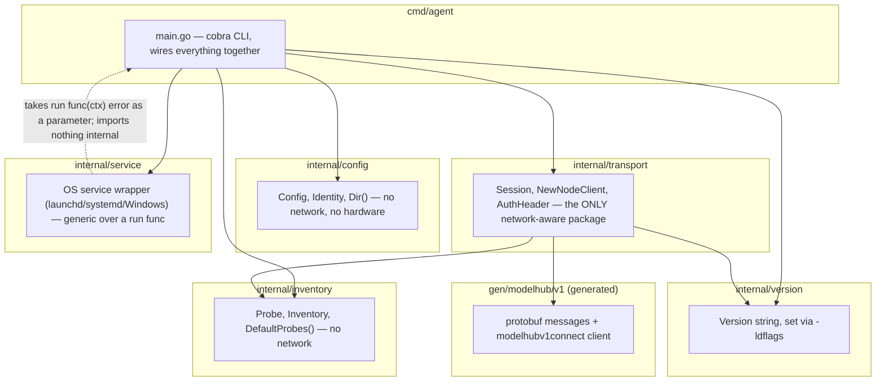
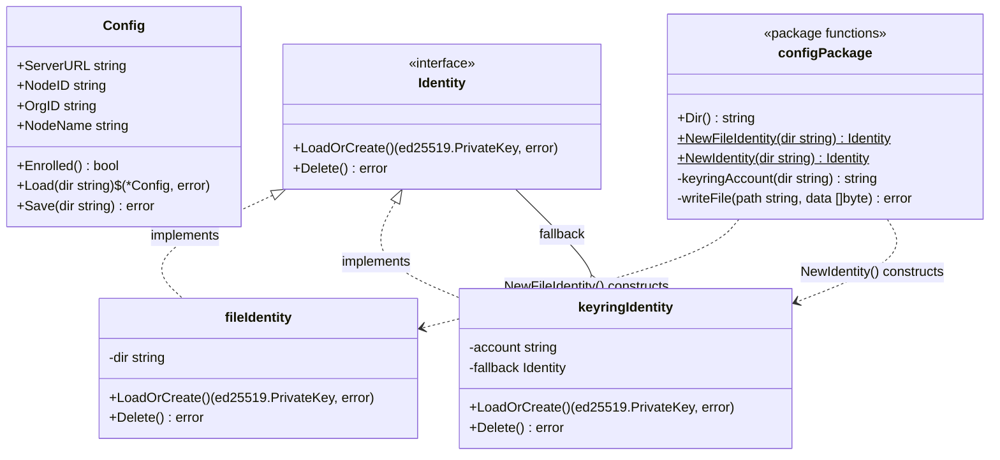
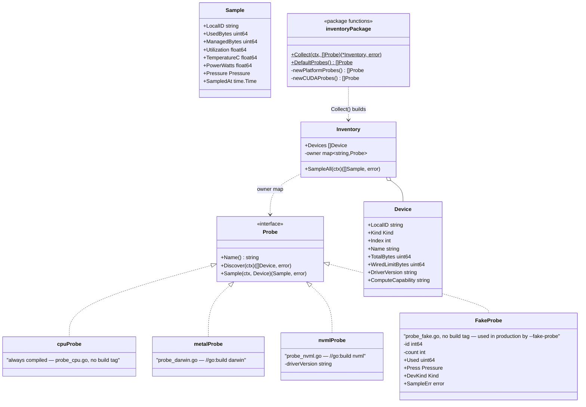
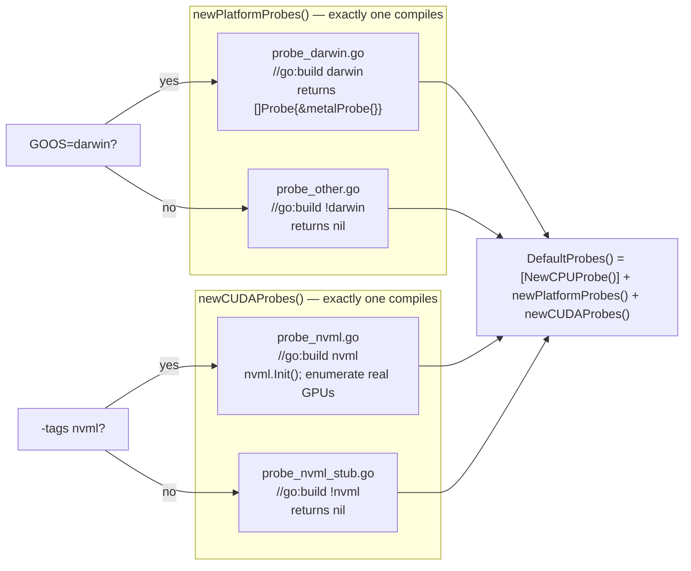
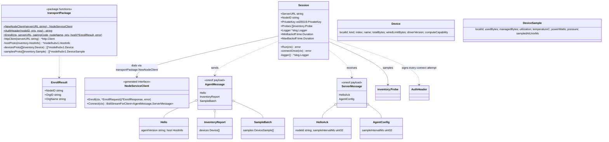
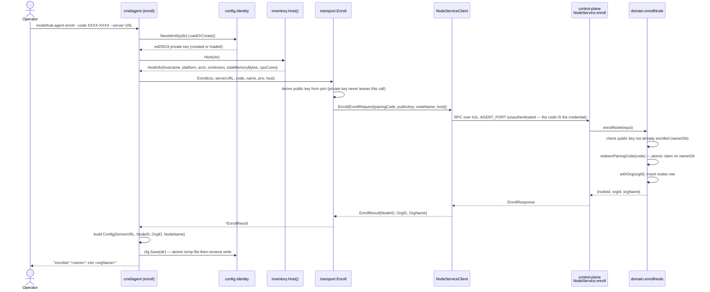

# Model Hub Agent — UML

The agent is the Go binary (`modelhub-agent`) installed on machines you own.
Slice 1 gives it five jobs: hold an identity, read local hardware, enroll
into an organization with a pairing code, and stream inventory/samples to
the control plane over a long-lived connection with reconnect-with-backoff.

A note on notation: Go has no classes. The `classDiagram` blocks below use
Go's actual vocabulary — `struct`, `interface`, free functions, build-tag
selected files — and lean on UML stereotypes (`<<interface>>`) and
composition/realization arrows only where they map onto a real Go relationship
(an interface satisfied by a type, a struct holding a field of another type).
Free functions that don't belong to any type are shown as functions attached
to their owning package's namespace, not invented methods.

---

## 1. Package structure



**What this tells you.** `internal/transport` is the only package that imports
`net/http`, `golang.org/x/net/http2`, or `connectrpc.com/connect`. `config`
and `inventory` are leaf packages — they know how to read a config directory
and probe hardware, respectively, and neither imports the other or
`transport`. `transport` imports `inventory` only to read `inventory.Host()`
for the `Hello`/`Enroll` payloads and to accept `[]inventory.Probe` as data —
it never reaches back into how a probe discovers a device. That one-way edge
is what makes `config` and `inventory` unit-testable with zero network
fixtures, and it's why `--fake-probe` (an `inventory.Probe` implementation)
can stand in for hardware without `transport` changing at all. `internal/service`
is generic over a `func(ctx) error`; `cmd/agent` is what actually binds it to
`runSession`, so `service` has no compile-time dependency on `transport`.

---

## 2. Identity and configuration model



**`Dir()` resolution**, in order:

1. `MODELHUB_CONFIG_DIR` environment variable, if set — always wins, used by
   tests and by anything that needs isolation from the real machine config.
2. Otherwise, root vs. user split by `os.Geteuid()`:
   - **root** (the installed system service runs as root/SYSTEM): a
     machine-wide path — `/etc/modelhub` on Linux/macOS, `%ProgramData%\ModelHub`
     on Windows.
   - **non-root** (`modelhub-agent` run by hand): `os.UserConfigDir()/modelhub`,
     falling back to `./.modelhub` if `UserConfigDir` itself fails.

**What this tells you.** `NewIdentity(dir)` prefers the OS keychain
(`keyringIdentity`) and falls back to a 0600 file (`fileIdentity`) — held as
a field, not re-derived — when the keychain is genuinely unavailable
(distinguished from "just empty": `keyring.ErrNotFound` triggers a fresh key,
any other keychain error triggers the file fallback with both errors
surfaced if that also fails). The keychain **account name is
`"node-key-" + hex(sha256(abs(dir))[:8])`** — derived from the resolved
config directory, not a fixed constant — so a root install at `/etc/modelhub`
and a developer's `~/.config/modelhub` (or two directories set via
`MODELHUB_CONFIG_DIR` for two independent agent instances on one box) each
get their own keychain entry and never collide. `Config` itself is a flat,
network-oblivious JSON blob (`config.json`) with no knowledge of `Identity`
at all — `cmd/agent` is what combines "am I enrolled" (`Config.Enrolled()`)
with "what's my key" (`Identity.LoadOrCreate()`) before building a `Session`.

---

## 3. The probe abstraction



### Build-tag selection: one definition per function, per build



**What this tells you.** `cpuProbe` (always present — "a node with no
accelerator is still a node") and `FakeProbe` (no build tag at all — it's a
regular exported type, gated only by the `--fake-probe` CLI flag in
`cmd/agent`, not by the build) are compiled into every binary. `metalProbe`
and `nvmlProbe` are compiled in only when their build tag matches, but
`newPlatformProbes()` and `newCUDAProbes()` are declared in **exactly one**
file per configuration — the Go compiler would refuse to build if two files
both defined the same function under overlapping tags. That's the mechanism:
`DefaultProbes()` in `inventory.go` calls those two functions unconditionally
and never needs an `if runtime.GOOS == ...` itself, because the build tags
already resolved which implementation exists before `go build` ever got to
`inventory.go`. `Inventory.owner` is unexported: callers only ever see
`Devices` and `SampleAll()`, never which `Probe` produced a given device.

---

## 4. The transport layer



**What this tells you.** `httpClient()` is where the h2c decision actually
lives: `http2.Transport` always builds a `tls.Config`, so the code can't
branch on "is TLS configured" — it branches once, up front, on
`serverURL`'s scheme (`http://` forces `AllowHTTP: true` and a plain-TCP
`DialTLSContext`, sending the HTTP/2 preface with no upgrade dance;
`https://` leaves TLS/ALPN negotiation to the transport as normal). Every RPC
shares one `*http.Client` with no overall timeout — liveness for the
long-lived `Connect` stream is HTTP/2 ping-based
(`ReadIdleTimeout`/`PingTimeout`), not a request deadline. `AuthHeader` is
called fresh on **every** connection attempt inside `connectOnce`, never
cached on `Session` — the server enforces a skew window and single-use
nonces, so a reused header would start failing the moment a reconnect landed
outside that window.

---

## 5. Sequence: enrollment



**What this tells you.** The identity key is generated (or loaded) **before**
the network call and never crosses the wire — only its public half does.
Enrollment is a single request/response RPC, not part of the streaming
`Connect` call, and it deliberately carries no auth header: the pairing code
is the only credential, because at this point the node has no `NodeID` yet
to sign with. If `cfg.Save` fails after the server already accepted the key
(see the error message built in `newEnrollCmd`), the CLI is explicit that
retrying `enroll` with a new code is the wrong move — the fix is local
(permissions/disk/`MODELHUB_CONFIG_DIR`), not a fresh pairing code.

---

## 6. Sequence: one connect-loop iteration

```mermaid
sequenceDiagram
    participant Run as Session.Run
    participant CO as Session.connectOnce
    participant NC as NodeServiceClient (bidi stream)
    participant NS as control-plane<br/>NodeService.connect
    participant Drain as receive-drain goroutine

    Run->>CO: connectOnce(ctx)
    CO->>NC: Connect(streamCtx)
    CO->>NC: set header Authorization: AuthHeader(NodeID, priv, now)
    NC->>NS: open bidi stream
    NS->>NS: authenticateNode(header) — before reading anything from the client
    CO->>NC: Send(AgentMessage{Hello{agentVersion, host}})
    NS-->>NC: yield ServerMessage{HelloAck{nodeId, sampleIntervalMs}}
    CO->>CO: Receive() → first = HelloAck; interval = sampleIntervalMs (or 5s default)
    CO->>CO: inventory.Collect(streamCtx, Probes) — Discover() on every probe
    CO->>NC: Send(AgentMessage{InventoryReport{devices}})
    NS->>NS: on "hello": markNodeOnline(orgId, nodeId, host)
    NS->>NS: on "inventory": recordInventory(orgId, nodeId, devices) — upsert + delete-missing
    CO->>Drain: spawn goroutine: loop Receive()
    loop every sampleInterval (ticker)
        CO->>CO: inv.SampleAll(streamCtx) — tolerates one bad probe
        CO->>NC: Send(AgentMessage{SampleBatch{samples}})
        NS->>NS: on "samples": recordSamples() — updates devices + nodes.lastSeenAt/status=online
    end
    Note over NC,NS: connection drops — network error, server restart, or ctx cancelled
    Drain->>Drain: Receive() returns error
    Drain->>CO: cancel() the streamCtx
    CO-->>Run: connectOnce returns (nil if server closed cleanly, err otherwise)
    Run->>Run: ctx.Err() != nil? → return nil immediately (no backoff)
    Run->>Run: else compute jittered wait = rand[0, backoff]; sleep
    Run->>Run: backoff = min(backoff*2, MaxBackoff)
    Run->>CO: connectOnce(ctx) — reconnect
```

**What this tells you.** Two things happen concurrently after inventory is
sent: the sampling loop on the main goroutine, and a drain goroutine whose
only job is to notice the stream ending (or a mid-stream `AgentConfig`
update) and `cancel()` the shared `streamCtx` — that's what makes a
server-initiated hang-up interrupt the *next tick* immediately rather than
waiting for one to come due. `AuthHeader` is rebuilt on every single call to
`connectOnce`, not reused across the loop's iterations, for exactly the skew/
nonce reason noted in the transport diagram. Backoff uses **full jitter**
(`rand.Int63n(backoff+1)`, not `backoff` itself) specifically so a whole
fleet that loses the control plane doesn't reconnect in lockstep the instant
it comes back.

---

## 7. State diagram: `Session.Run`

```mermaid
stateDiagram-v2
    [*] --> Connecting

    Connecting: Connecting\ndial + AuthHeader + Hello + await HelloAck
    Streaming: Streaming\ninventory sent, ticker sampling, drain goroutine watching
    Backoff: Backoff\njittered sleep; backoff *= 2, capped at MaxBackoff
    Stopped: Stopped\nRun returns nil

    Connecting --> Streaming : auth + hello + inventory succeed
    Connecting --> Backoff : dial/auth/send/receive error
    Streaming --> Backoff : stream error, drop, or clean server close
    Backoff --> Connecting : wait elapsed — reconnect attempt

    Connecting --> Stopped : ctx cancelled (checked at loop top, or streamCtx dies mid-attempt)
    Streaming --> Stopped : ctx cancelled — CloseRequest() sent, returns nil
    Backoff --> Stopped : ctx cancelled during the jittered sleep

    Stopped --> [*]
```



**What this tells you.** Every long-running state — `Connecting`,
`Streaming`, and `Backoff` — has a direct edge to `Stopped`, and the code
enforces this at three separate points: the loop-top `ctx.Err()` check in
`Run`, the `select` inside `connectOnce`'s sampling loop
(`case <-streamCtx.Done()`), and the `select` around the backoff sleep in
`Run`. That's deliberate redundancy: whichever state the goroutine happens
to be in when the caller cancels its context, `Run` is guaranteed to notice
within one `select` and return `nil` — never an error, and never a hang.
There is no error return from `Run` for "the server was unreachable"; that
condition just keeps cycling `Connecting → Backoff → Connecting` forever
until either it succeeds or the context is cancelled.

---

## 8. The CLI surface

| Command | Purpose |
|---|---|
| `modelhub-agent status` | Loads `Config` and reports whether this node is enrolled — and if so, its node/org IDs and server URL. Read-only; touches no network. |
| `modelhub-agent enroll --code XXXX-XXXX --server <url> [--name <name>]` | Loads or creates this node's identity, gathers `HostInfo`, calls `transport.Enroll`, and persists the resulting `Config`. `--server` defaults to `http://localhost:3001` (the agent/h2c port, **not** the browser port) and must point at `AGENT_PORT`. `--code` is required. |
| `modelhub-agent run [--fake-probe]` | Builds a `Session` from the saved `Config`/`Identity` and calls `Session.Run(ctx)` in the foreground; this is also the exact command the installed system service execs. `--fake-probe` swaps in `inventory.NewFakeProbe(2)` after construction — used by CI and anyone without real GPU hardware. |
| `modelhub-agent install` | Refuses if the node isn't enrolled (a service that can never authenticate would just crash-loop). Otherwise registers `modelhub-agent run` as a system service (launchd/systemd/Windows, via `internal/service`) and starts it. |
| `modelhub-agent uninstall` | Stops and removes the system service registration **and** deletes this node's stored identity (both keychain and file fallback), so a later `enroll` creates a genuinely fresh identity. Does not remove `config.json` or the binary — that's left to the operator, per `docs/install.md`. |

All five share `config.Dir()` for locating state, and `status`/`enroll`/`run`/`install`
all reject or short-circuit on an un-enrolled node in their own way — `run`
by refusing to build a `Session` at all (`newSession` returns an error before
any network happens), `install` by checking `Config.Enrolled()` explicitly
before touching the service manager.
