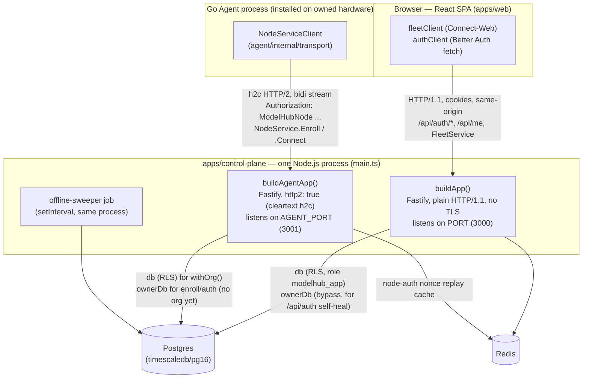
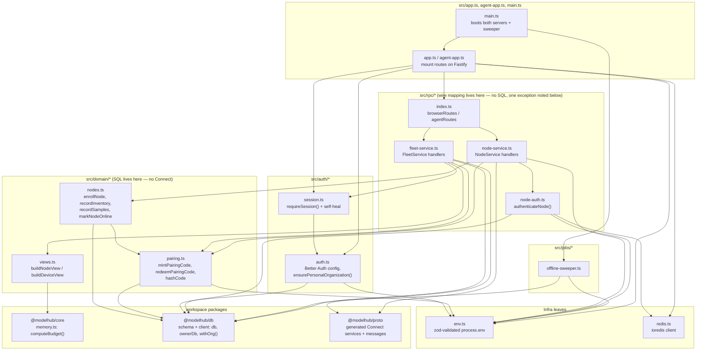
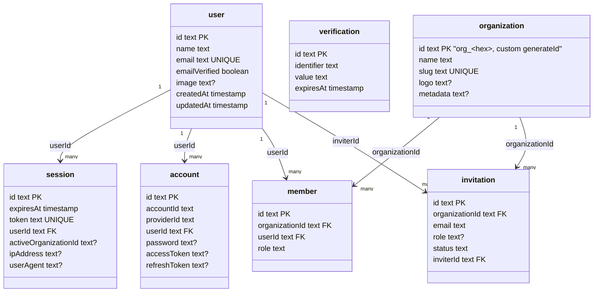
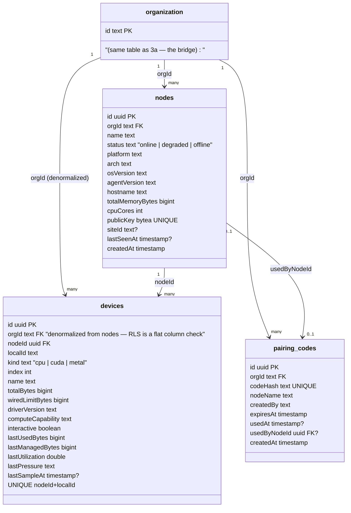
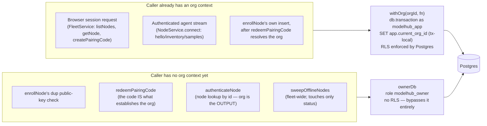
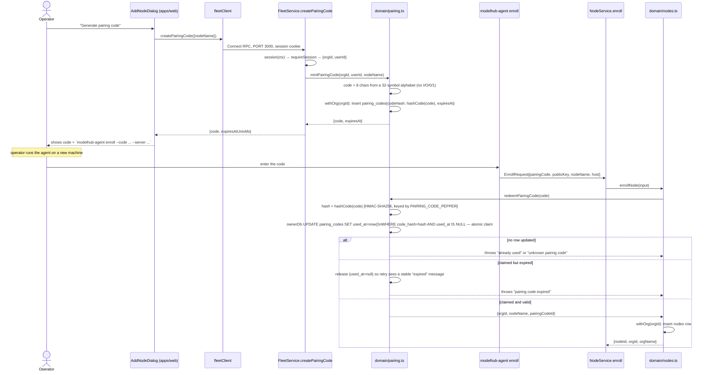
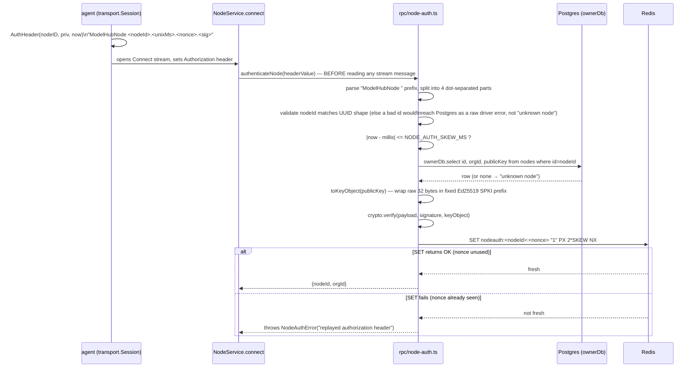
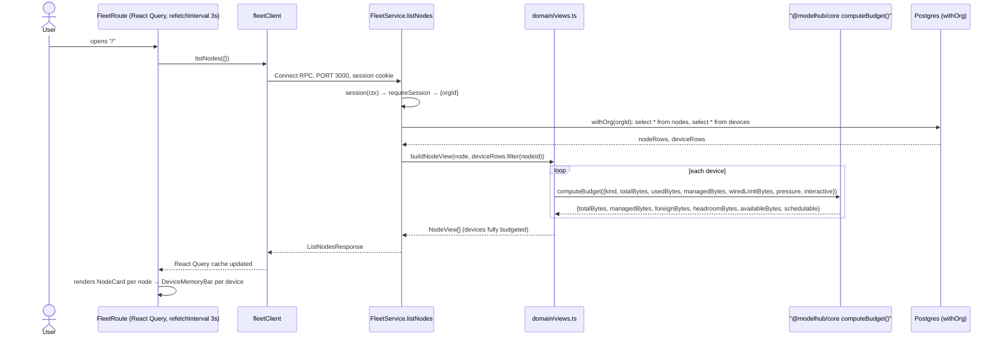
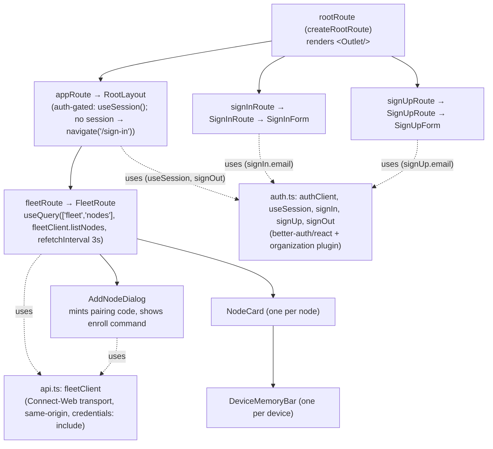
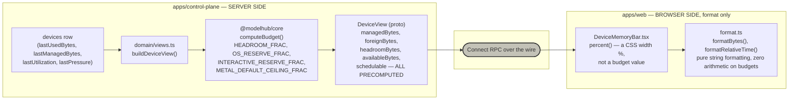

# Model Hub Control Plane — UML

The control plane is `apps/control-plane` (Fastify + Connect RPC + Drizzle
over Postgres + Redis) and `apps/web` (a React SPA served separately by
Vite in dev). Together they authenticate agents, record what a fleet
reports, and let a signed-in browser see it. Slice 1 stops at enroll /
authenticate / stream / display — no model execution.

---

## 1. Deployment / component view



**What this tells you.** This is two separate Fastify *instances* in one
process, not one server with two routes — and that split is forced, not
stylistic. `NodeService.Connect` is a true bidirectional stream, which needs
real HTTP/2 framing; `buildAgentApp()` gets that cheaply in dev by serving
cleartext h2c (`http2: true`, no TLS). Browsers, unlike this repo's own Go
agent, **cannot** speak h2c at all — HTTP/2 in a browser requires
TLS/ALPN negotiation — so the browser-facing `buildApp()` has to stay plain
HTTP/1.1. One port genuinely cannot serve both audiences; that's why
`AGENT_PORT` (3001) and `PORT` (3000) exist as two independent listeners in
one `main.ts`, both created and torn down together on `SIGINT`/`SIGTERM`.

---

## 2. Module structure



**What this tells you — the layering rule, and its one honest exception.**
`domain/*` is where every `select`/`insert`/`update`/transaction lives, and
it imports nothing from `@connectrpc/connect` or the generated proto types —
it takes and returns plain interfaces (`EnrollInput`, `DeviceRow`, `NodeRow`).
`rpc/*` is where every Connect handler and wire-shape mapping lives, and it
imports no SQL — **with one exception, stated plainly rather than smoothed
over**: `rpc/node-auth.ts` runs its own `ownerDb.select(...).from(nodes)`
directly rather than going through `domain/nodes.ts`, because the query it
needs (look up a node by ID, get back its public key) doesn't correspond to
any domain operation the rest of the app needs, and it also owns the Redis
nonce-replay check that has no natural home in `domain/*` either. Every
other `rpc/*` file honors the rule. `domain/views.ts` is the only file that
touches `@modelhub/core`: `computeBudget()` runs exactly once, server-side,
on the read path (see §7).

---

## 3. Data model

Two related schemas, split because they carry very different trust levels
(see the RLS diagram, §4). `organization` is the bridge between them.

### 3a. Better Auth's own tables — no row-level security



### 3b. Fleet tables — row-level security enabled



**Which tables carry RLS, and why.** `nodes`, `devices`, and `pairing_codes`
have `ENABLE ROW LEVEL SECURITY` plus an identical-shaped policy each
(`org_id = current_setting('app.current_org_id', true)`, both `USING` and
`WITH CHECK`) — see `packages/db/migrations/0001_roles_and_rls.sql`. These
are the tables holding tenant secrets or tenant-owned hardware facts: a bug
that forgets to scope a query here should return *nothing*, not another
org's GPUs. `user`, `session`, `account`, `verification`, `organization`,
`member`, and `invitation` carry **no** RLS — they're Better Auth's own
tables, and Better Auth's adapter needs unrestricted access to them to do
things like "find the user by email across all orgs" during sign-in, which
is not an org-scoped operation by nature. `devices.orgId` is deliberately
denormalized from `nodes.orgId` specifically so its RLS policy is a flat
column comparison rather than a subquery joining out to `nodes` on every row.

---

## 4. Database access model: `withOrg()` vs. `ownerDb`



**What this tells you.** `withOrg()` is not a query filter bolted on in
application code — it sets a transaction-local Postgres session variable
(`set_config('app.current_org_id', orgId, true)`) and lets the RLS policies
in §3b do the actual enforcement, so even a handler that writes a careless
query still can't cross tenants. `ownerDb` exists for exactly the requests
where that's structurally impossible: enrollment and node authentication
both run *before* an org is known — the pairing code or the node row **is**
how the org gets determined — so there is nothing to scope the RLS session
variable to yet. `packages/db/src/client.ts`'s `db`/`appSql` (RLS-bound,
`DATABASE_URL`) and `ownerDb`/`ownerSql` (RLS-bypassing,
`DATABASE_OWNER_URL`) are two separate connection pools for exactly this
reason — same schema, deliberately different privilege. The offline sweeper
also uses `ownerDb`: it's a fleet-wide background job with no single org
context, and it only ever flips a `status` column, so there's no tenant data
it could leak by bypassing RLS.

---

## 5. Sequence diagrams

### 5a. Sign-up, organization creation, and the self-heal path

```mermaid
sequenceDiagram
    actor User
    participant Browser as SignUpForm (apps/web)
    participant AC as authClient
    participant App as buildApp() /api/auth/*
    participant BA as Better Auth
    participant Hook as databaseHooks.user.create.after
    participant Later as a later request<br/>(e.g. GET /api/me)
    participant Sess as requireSession()

    User->>Browser: submits name/email/password
    Browser->>AC: signUp.email({name, email, password})
    AC->>App: POST /api/auth/sign-up/email
    App->>BA: auth.handler(request)
    BA->>BA: create user + account rows (transaction, generateId → hex id)
    BA-->>Hook: queueAfterTransactionHook (runs AFTER commit)
    Hook->>Hook: ensurePersonalOrganization(user)\nslug=org-<hex>, name="<user>'s fleet"
    alt organization created successfully
        Hook->>Hook: organization + member rows inserted
    else creation throws
        Hook->>Hook: caught, logged — NOT rethrown\n(user/account already committed; sign-up must not fail)
    end
    BA-->>App: 200, session cookie set
    App-->>Browser: sign-up succeeds regardless of hook outcome
    Browser->>Browser: navigate to "/"

    Note over Later,Sess: any later authenticated request
    Later->>Sess: requireSession(req)
    Sess->>BA: getSession(headers)
    Sess->>Sess: orgId = session.activeOrganizationId ?? listOrganizations()[0]
    alt orgId found
        Sess-->>Later: {userId, orgId}
    else still no org (hook failed earlier)
        Sess->>Sess: self-heal: ensurePersonalOrganization(session.user) again
        alt self-heal succeeds
            Sess-->>Later: {userId, orgId}
        else self-heal also fails
            Sess-->>Later: throws HttpError(403, "no_organization")
        end
    end
```

**What this tells you.** The org-creation hook is deliberately non-fatal —
it runs after the sign-up transaction has already committed, so throwing
would strand an already-real user behind a failed sign-up call they can't
retry (their email is taken). The fix is deferred to the one place the
invariant actually matters: `requireSession()`, which every authenticated
request already goes through, retries `ensurePersonalOrganization` lazily
using the exact same naming/slug logic — so whichever path fires, the
resulting organization looks the same.

### 5b. Pairing-code mint and redeem



**What this tells you.** The code's confidentiality rests on
`PAIRING_CODE_PEPPER`, an application secret never stored alongside
`code_hash` — a leak of the `pairing_codes` table alone (backup, scoped
read-only breach) isn't enough to brute-force the ~40-bit codespace offline.
Redemption is race-safe by construction: the `UPDATE ... WHERE used_at IS
NULL ... RETURNING` is the atomicity boundary, not an application-level
check-then-act.

### 5c. Node authentication (`authenticateNode`)



**What this tells you.** Every failure mode short-circuits to
`NodeAuthError` (mapped to HTTP 401) before anything downstream runs — the
generator function in `node-service.ts` calls `authenticateNode` as its very
first line, so a rejected caller can never cause a single database write.
The nonce replay cache lives in Redis, not an in-process `Map`, because the
control plane is meant to run as multiple stateless replicas; the TTL is
`2 × NODE_AUTH_SKEW_MS`, exactly long enough to cover a nonce presented at
the edge of the skew window on a retry.

### 5d. Fleet page read



**What this tells you.** By the time this response leaves the server, every
byte figure the browser will render is already final — see §7 for why that
boundary matters and where it's drawn.

---

## 6. Web app component tree



**What this tells you.** `RootLayout` is the single auth gate for the whole
authenticated section of the app — `signInRoute`/`signUpRoute` sit outside
it as siblings of `appRoute`, not children, so they render even with no
session, while everything under `appRoute` (today, just `fleetRoute`) is
unreachable without one. The two clients attach at different altitudes:
`fleetClient` is used directly by leaf components that need fleet data
(`FleetRoute`, `AddNodeDialog`); `authClient`'s `useSession` is used at the
layout level (`RootLayout`) to gate rendering, and again by the two
presentational, dependency-free `*Form` components' route wrappers
(`SignInRoute`, `SignUpRoute`) to call `signIn.email`/`signUp.email`.

---

## 7. The memory-budget boundary



**What this tells you.** `computeBudget()` runs exactly once per device, per
read, entirely inside `domain/views.ts` on the server — every quantity
`DeviceMemoryBar.tsx` displays (`managedBytes`, `foreignBytes`,
`headroomBytes`, `availableBytes`, `schedulable`) crosses the wire already
final. The browser's `percent()` function looks like arithmetic but isn't a
budget calculation — it derives a CSS width from numbers it doesn't own, for
layout only, and `format.ts` does nothing but turn bytes into strings. The
architecture-level reasoning for *why* the formulas look the way they do
(the headroom/OS-reserve/interactive-reserve fractions, the Metal wired-limit
handling) lives in the architecture doc, not here — this diagram exists only
to make the boundary itself visible.
